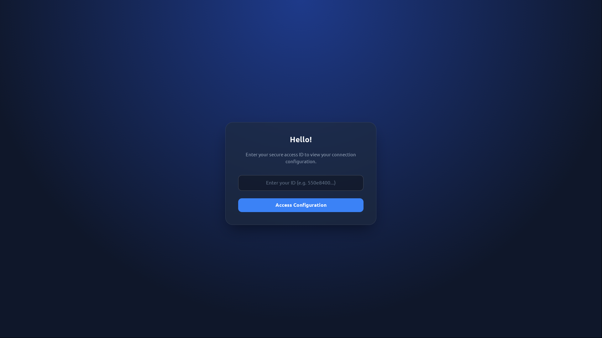
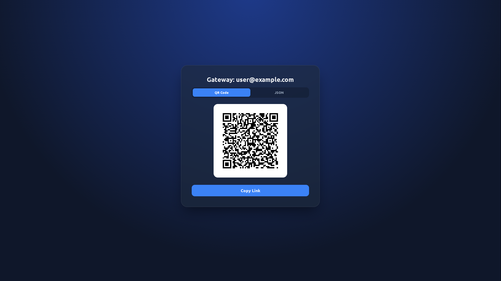
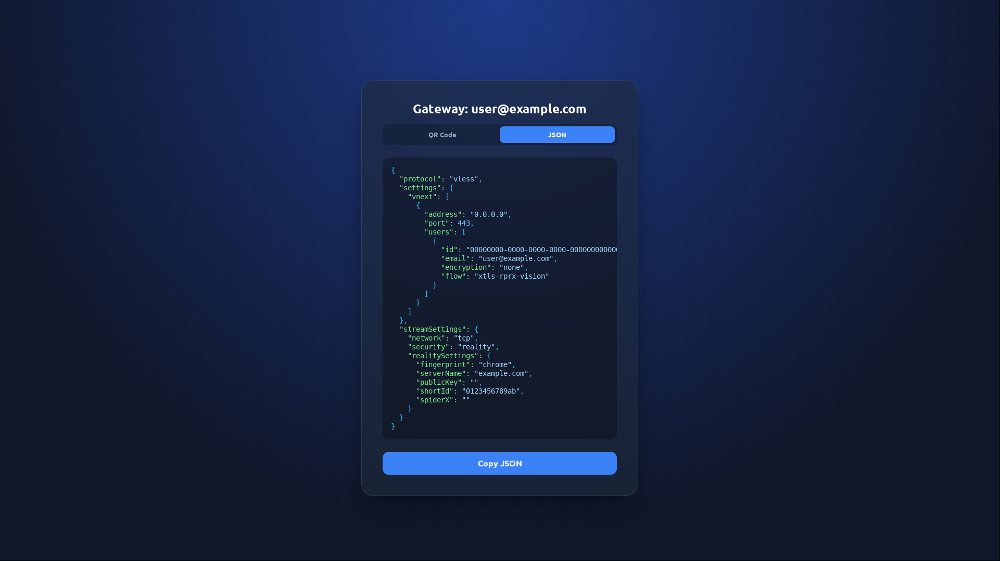

# xraymgr

<p align="left">
  
  
  
</p>

I wrote this utility to make managing my own Xray server easier. It's a simple, 
fast tool for adding/removing clients and generating VLESS links with QR codes 
directly in the terminal.

<p align="center">
  
  
  
</p>

If you want to manage a vanilla `xray-core` setup without installing heavy 
web panels, this tool provides the basic essentials. You can keep editing your 
config in your favorite text editor, use this CLI to manage users, and generate 
static HTML pages with configurations for end users. It gives you control over 
your server while simplifying daily tasks.

I understand that it doesn't cover all possible Xray configurations yet, but 
it works well for quick user management and sharing configs on a personal 
server. If you need a missing feature, feel free to open a PR!

---

## Installation & Usage

### Running via Nix
If you use Nix, you can run the utility directly without installing it. 
*(Make sure to pass the path to your config and the server address if they are 
not in the current directory)*:

```bash
nix run github:MOIS3Y/xraymgr -- \
    --config /path/to/config.json \
    list
```

### Standard Installation
```bash
git clone https://github.com/MOIS3Y/xraymgr
cd xraymgr
cargo install --path .
```

## Configuration & Fallbacks

To avoid typing the same flags over and over, `xraymgr` follows this 
hierarchy. You can pass parameters either as CLI options (flags) or 
Environment Variables:

| Parameter | CLI Flag | Env Variable | Default / Fallback |
|-----------|----------|--------------|--------------------|
| **Config**| `--config` | `XRAYMGR_CONFIG` | `config.json` |
| **Tag** | `--tag` | `XRAYMGR_TAG` | `vless-in` |
| **Address**| `--address`| `XRAYMGR_ADDRESS`| `listen` from config|

For example, you can add this to your `.bashrc` or `.envrc` so you never have 
to type them manually:
```bash
export XRAYMGR_CONFIG="/etc/xray/config.json"
export XRAYMGR_ADDRESS="my.vpn.server"
export XRAYMGR_TAG="vless-reality"
```

## Commands

All commands support passing configuration parameters directly via flags if you 
haven't set up the environment variables.

### Listing Clients
```bash
xraymgr \
    --config /path/to/config.json \
    --tag "vless-in" \
    list
```

### Adding a Client
```bash
xraymgr \
    --config /path/to/config.json \
    add "user@example.com"
```

### Removing a Client
```bash
xraymgr \
    --config /path/to/config.json \
    remove "user@example.com"
```

### Showing Connection Info
```bash
xraymgr \
    --config /path/to/config.json \
    show "user@example.com" \
    --address "my.server.com"
```

> [!NOTE]
> If the `--address` flag or `XRAYMGR_ADDRESS` environment variable is not 
> provided, the utility will automatically fallback to using the `listen` 
> field from your inbound configuration.

### Generating Static HTML Configurations
```bash
# Generate a random ID and save the HTML output
SECRET_ID=$(openssl rand -hex 16)
xraymgr \
    --config /path/to/config.json \
    html "user@example.com" \
    --address "my.server.com" \
    > /var/www/html/${SECRET_ID}.html

echo "Link: https://gateway.yourdomain.com/${SECRET_ID}.html"
```
*Outputs a self-contained HTML page with a QR code and JSON config.*

### Using Custom HTML Templates
If you want to use a custom layout or your own styles, you can provide a custom 
HTML template using the `--template` flag:
```bash
xraymgr \
    --config /path/to/config.json \
    html "user@example.com" \
    --template /path/to/my_theme.html \
    > /var/www/html/user.html
```
Your template must include the following placeholders:
- `{{ XRAY_NAME }}` — Replaced with the client's email/name.
- `{{ XRAY_LINK }}` — Replaced with the raw `vless://...` URL.
- `{{ XRAY_QR_SVG }}` — Replaced with the raw `<svg>...</svg>` markup.
- `{{ XRAY_JSON }}` — Replaced with the raw JSON client configuration.

## Static Web Gateway

You can use the `html` command to generate static pages and serve them as a 
web portal for your users without needing a backend.

### 1. Setup the Gateway Portal
Fetch the `index.html` gateway directly from this repository:
```bash
mkdir -p /opt/xraymgr/www
curl -sL https://raw.githubusercontent.com/MOIS3Y/xraymgr/main/examples/index.html \
    -o /opt/xraymgr/www/index.html
```
This `index.html` contains an input field where users can type their UUID. 
A tiny piece of Javascript will instantly redirect them to `/<uuid>.html`.

### 2. Generate Client Configs
When adding a new client, output their configuration directly to this folder. 
Avoid using their actual Xray UUID to prevent leaving direct traces; instead, 
generate a random secret string:
```bash
SECRET_ID=$(openssl rand -hex 16)
xraymgr html "user@example.com" > /opt/xraymgr/www/${SECRET_ID}.html
```

### 3. Serve securely (Docker Compose Examples)
You can serve this folder using zero-configuration static servers with 
automatic HTTPS.

**Example 1: Caddy (Automatic HTTPS)**
```yaml
services:
  caddy:
    image: caddy:alpine
    restart: unless-stopped
    ports:
      - "80:80"
      - "443:443"
    volumes:
      - /opt/xraymgr/www:/usr/share/caddy
    command: caddy file-server --domain gateway.yourdomain.com
```

**Example 2: Traefik + Nginx (Full Example)**
```yaml
services:
  nginx:
    image: nginx:alpine
    restart: unless-stopped
    volumes:
      - /opt/xraymgr/www:/usr/share/nginx/html:ro
    labels:
      - "traefik.enable=true"
      - "traefik.http.routers.gateway.rule=Host(`gateway.yourdomain.com`)"
      - "traefik.http.routers.gateway.entrypoints=websecure"
      - "traefik.http.routers.gateway.tls.certresolver=letsencrypt"
```
*(No Nginx config needed! Default Nginx has `autoindex off` and serves 
`index.html`.)*

### Security Recommendations
This "Security by Obscurity" approach is highly secure if you follow these 
rules:
- **Always use SSL/TLS**: Serve the portal via HTTPS (like Caddy or Traefik 
  above) to prevent network interception of the secret IDs.
- **Use Random Hex Filenames**: Never use `ivan.html` or the client's actual 
  Xray UUID. A random string (like `openssl rand -hex 16`) is impossible to 
  brute-force and leaves no trace to the VPN config.
- **No Directory Listing**: Ensure your web server does not reveal directory 
  contents (e.g., Nginx `autoindex off;` which is the default).
- **Search Engine Protection**: The generated HTML files already include a 
  `<meta name="robots" content="noindex, nofollow">` tag so Google won't 
  index leaked links.

## Current Limitations

- **Protocol**: VLESS only.
- **Security**: Reality and TLS are supported and parsed dynamically.
- **Transport**: Dynamically detects `tcp`, `ws`, `grpc`, etc., but 
  specifically tailored towards modern setups (like XTLS Vision).

If your setup is different and you want to add support for it, PRs are welcome!
